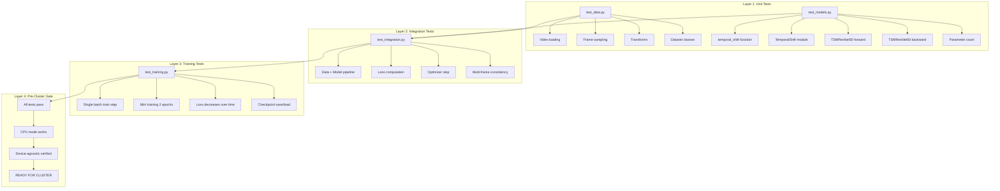
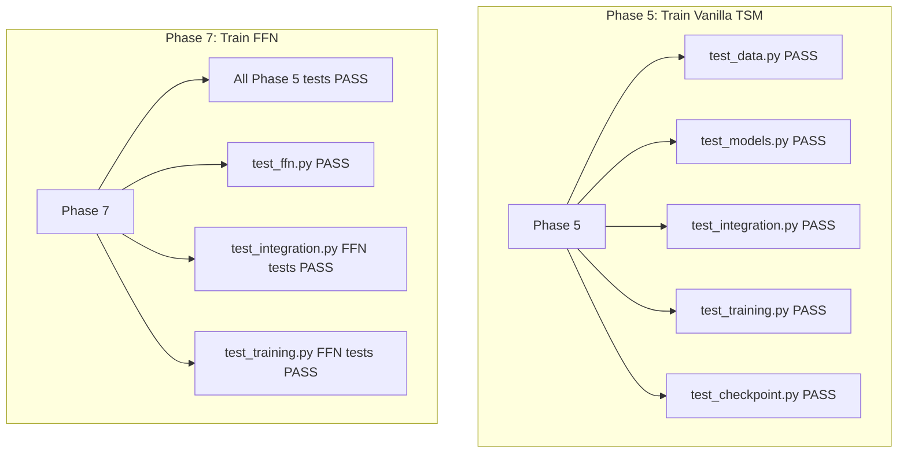

# End-to-End Testing Plan

**Purpose**: Ensure all code is fully validated BEFORE any cluster submission. Cluster debugging is painful - no interactive debugging, queue times, limited access. All issues must be caught locally.

---

## Testing Philosophy

```
NO CLUSTER SUBMISSION UNTIL ALL LOCAL TESTS PASS
```

This is not optional. Every component, every integration, every edge case must be verified locally before spending cluster compute time.

---

## Test File Naming Convention

| Source File/Folder | Test File |
|-------------------|-----------|
| `src/data/` | `tests/test_data.py` |
| `src/models/` | `tests/test_models.py` |
| `src/training/` | `tests/test_training.py` |
| Integration tests | `tests/test_integration.py` |
| Checkpoint tests | `tests/test_checkpoint.py` |

---

## Testing Layers



---

## Detailed Test Coverage

### Layer 1: Unit Tests

#### test_data.py (src/data/)

| Test | What It Verifies |
|------|------------------|
| `test_frame_sampling` | Uniform sampling divides video into T segments |
| `test_video_loading` | PyAV loads .webm files correctly |
| `test_transforms` | Train/val transforms produce correct shapes |
| `test_single_frame_dataset` | SSv2Dataset returns (C, T, H, W) tensor + label |
| `test_multi_frame_dataset` | SSv2MultiFrameDataset returns v_L, v_M, v_H |
| `test_dataloader` | Batching works, shapes are (B, C, T, H, W) |

#### test_models.py (src/models/)

| Test | What It Verifies |
|------|------------------|
| `test_temporal_shift_function` | Channel shifting works correctly |
| `test_temporal_shift_module` | Module wrapper applies shift then conv |
| `test_tsm_resnet50_forward` | Full forward pass produces (B, 174) |
| `test_tsm_resnet50_backward` | Gradients flow to all parameters |
| `test_tsm_resnet50_multi_frame` | Works with T=4, 8, 16 |
| `test_parameter_count` | ~24M parameters (sanity check) |

#### test_ffn.py (src/models/ - FFN components)

| Test | What It Verifies |
|------|------------------|
| `test_specialized_batchnorm` | Separate BN params per frame count |
| `test_weight_alteration` | Adapter convs work correctly |
| `test_ffn_forward_all_frame_counts` | 4F, 8F, 16F all produce outputs |
| `test_kl_divergence_loss` | Temporal distillation loss computes |
| `test_combined_loss` | CE + lambda*KL works |

#### test_eval.py (Phase 8 evaluation script)

| Test | What It Verifies |
|------|------------------|
| `test_load_16f_checkpoint_at_16f` | TSM checkpoint loads at matching frame count |
| `test_load_16f_checkpoint_at_8f` | TSM checkpoint loads at different frame count (TFD eval) |
| `test_load_16f_checkpoint_at_4f` | TSM checkpoint loads at 4F (key TFD test) |
| `test_checkpoint_has_expected_keys` | Checkpoint contains model_state_dict, epoch, best_acc |
| `test_load_ffn_checkpoint` | FFN checkpoint loads correctly |
| `test_forward_pass[4/8/16]` | TSM forward works at each frame count after loading 16F checkpoint |
| `test_outputs_are_valid_logits[4/8/16]` | No NaN/Inf in outputs |
| `test_inference_single_frame_count[4/8/16]` | FFN inference mode works per frame count |
| `test_perfect_accuracy` | Accuracy function on correct predictions |
| `test_zero_accuracy` | Accuracy function on wrong predictions |
| `test_top5_includes_correct` | Top-5 finds correct class when not top-1 |
| `test_single_update` | AverageMeter tracking |
| `test_weighted_average` | Weighted average across batches |
| `test_count_tracks_total` | Sample count accumulation |

---

### Layer 2: Integration Tests

#### test_integration.py


| Test | What It Verifies |
|------|------------------|
| `test_data_to_model_pipeline` | DataLoader output fits model input |
| `test_loss_computation` | CrossEntropy computes without error |
| `test_backward_pass` | Gradients propagate through full pipeline |
| `test_optimizer_step` | Weights update after step |
| `test_multi_frame_pipeline` | FFN multi-frame training step works |

---

### Layer 3: Training Tests

#### test_training.py

| Test | What It Verifies |
|------|------------------|
| `test_single_train_step` | One batch trains without error |
| `test_mini_training_run` | 2 epochs on 100 videos, loss decreases |
| `test_validation_step` | Eval mode produces predictions |
| `test_accuracy_computation` | Top-1/Top-5 accuracy calculates |

#### test_checkpoint.py

| Test | What It Verifies |
|------|------------------|
| `test_save_checkpoint` | Model state saves to disk |
| `test_load_checkpoint` | Model state loads from disk |
| `test_checkpoint_integrity` | Loaded model produces same outputs |
| `test_resume_training` | Training continues correctly from checkpoint |
| `test_optimizer_state` | Optimizer state saves/loads |

---

### Layer 4: Pre-Cluster Gate

Before ANY cluster submission, run:

```bash
# Full test suite
python -m pytest tests/ -v

# CPU-only mode (simulates no GPU available)
CUDA_VISIBLE_DEVICES="" python -m pytest tests/ -v

# Specific cluster-critical tests
python -m tests.test_training
python -m tests.test_checkpoint
```

**All tests must pass. No exceptions.**

---

## Test Requirements by Phase



| Before Phase | Required Tests |
|--------------|----------------|
| Phase 5 (Vanilla TSM Training) | test_data, test_models, test_integration, test_training, test_checkpoint |
| Phase 7 (FFN Training) | All above + test_ffn + FFN-specific integration/training tests |
| Phase 8 (Unified Evaluation) | eval script local test (few batches), checkpoint loading verified |

---

## Running Tests

```bash
# Activate virtual environment
source .venv/bin/activate

# Run all tests
python -m pytest tests/ -v

# Run specific test file
python -m pytest tests/test_data.py -v

# Run specific test function
python -m pytest tests/test_models.py::test_tsm_resnet50_forward -v

# Run with coverage
python -m pytest tests/ --cov=src --cov-report=html

# Force CPU mode
CUDA_VISIBLE_DEVICES="" python -m pytest tests/ -v
```

---

## Test Output Checklist

Before cluster submission, verify:

- [ ] `pytest tests/` shows ALL PASSED
- [ ] `CUDA_VISIBLE_DEVICES="" pytest tests/` shows ALL PASSED
- [ ] Mini training run completes without error
- [ ] Checkpoint saves and loads correctly
- [ ] Loaded model produces identical outputs
- [ ] All frame counts (4, 8, 16) work
- [ ] Loss values are reasonable (not NaN, not exploding)
- [ ] Memory usage is acceptable for cluster GPU

---

## Debugging Failed Tests

If a test fails:

1. **Read the error message** - often tells you exactly what's wrong
2. **Check shapes** - most common issue is tensor shape mismatch
3. **Check device** - tensors must be on same device
4. **Check gradients** - ensure requires_grad=True where needed
5. **Simplify** - reduce batch size, frame count, test with minimal input
6. **Compare to reference** - check official FFN repo implementation

---

## Adding New Tests

When adding new functionality:

1. Write the test FIRST (test-driven development)
2. Make the test fail
3. Implement the feature
4. Make the test pass
5. Commit both test and feature together

---

*This document is the source of truth for testing. Update as new tests are added.*
